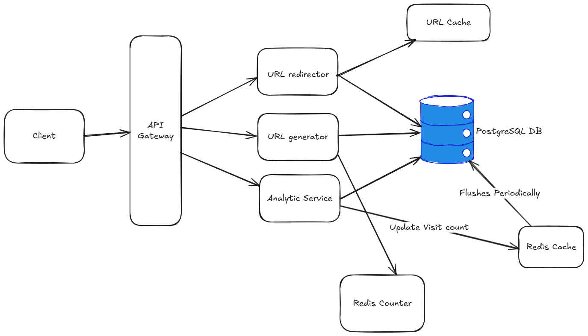

##  Overview

**ZapLink** is a modern, fast, and privacy-friendly URL shortener.  
It allows users to shorten URLs and view basic analytics like click counts, referrer info, and more.

Built with **Nodejs**, **PostgreSQL**, and **Redis**, it's designed to be lightweight and developer-friendly.

##  Key Features

-  URL shortening with optional custom aliases
-  Basic analytics (click count, location, timestamp)
-  Admin panel with authentication
-  Expiry support for short links
-  Redis caching for fast redirection

##  Tech Stack

| Layer          | Technology              |
|----------------|--------------------------|
| Backend        | Nodejs     |
| Database       | PostgreSQL + Redis       |
| Deployment     | Docker, Railway/Vercel   |

##  Architecture

Here’s a high-level view of our system:

##  Module Breakdown *(optional)*

###  URL Module
- Create short links
- Resolve and redirect

###  Analytics Module
- Track access logs
- Aggregate reports

###  Auth Module
- Admin login
- Basic auth token validation

---

##  Future Plans

- OAuth login (Google, GitHub)
- QR code generation for each link
- Dashboard UI for analytics
- Rate limiting and abuse protection
- Authentication

> _ZapLink is open-source and actively maintained. Contributions are welcome!_
